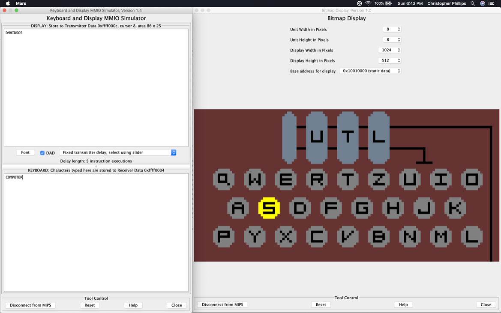

## Introduction

The purpose of this document is to outline my submission for my Computer Architecture class project, in which I created a simulation of the Enigma machine in MIPS assembly language (the Enigma Machine Simulator, or EMS). Below is a brief outline of this document. 

1. The Enigma machine 
2. The Enigma machine simulator (EMS) 
3. Setting up the EMS 
4. Using the EMS 
5. EMS sample run walkthrough 
6. Code 
7. Questions/troubleshooting 

## The Enigma machine 

The Enigma machine is an electro-mechanical device used to encrypt/decrypt messages. It was invented in Germany in the 1920s, and used extensively by Germany, Japan, et. al. during World War 2. Deciphering the machine’s messages was a large part of the war effort among the Allied forces (a certain Alan Turing played a key role in that particular effort). 

 

**Fig 1- Enigma machine**							 **Fig 2- Exploded enigma rotor**
Source: http://www.wikipedia.org             			 Source: http://www.accordingtobenedict.com

Note that the machine itself doesn’t actually send any messages- it simply encodes them, and leaves the actual transit of the message to the user (e.g. by telegram/Morse code/etc.). 

The Enigma machine has four main components: 

1. Three rotors
 2. Keyboard
3. Lampboard 
4. Plugboard 

The rotors are, in a sense, the “heart” of the machine- they have 26 contacts on each side (one for each letter of the alphabet), and have crisscrossing wires on the inside that effectively scramble the letters of the alphabet (as seen in fig 2 above). When the user starts an Enigma session (either encrypting or decrying a message), s/he may set the three rotors to a particular letter sequence (e.g. “U - T - D”) to determine how the letters are scrambled or unscrambled. Lastly, as the user enters messages on the keyboard, the rotors turn as each key is depressed, further scrambling the message. 

The keyboard is pretty self-explanatory- it’s used to type messages to be encrypted or decrypted. 

The lampboard is the visual means by which the machine outputs encrypted/decrypted letters. Each time the user enters a letter on the keyboard, a corresponding lamp on the lampboard will light up, illuminating a letter and indicating the encrypted/decrypted character. For instance, if someone is encrypting a message and enters “T”, the lampboard may display, say, an “E”, thus encrypting “T” to “E”. 

The plugboard provides a way to further scramble letters beyond the rotors by re-mapping selected pairs of letters (say, remapping the letter S to the letter G). Note that my simulation does not implement the plugboard (ran out of development time), so you can ignore it for the remainder of this document. 

## The Enigma machine simulator (EMS)

With the concept of the Enigma machine in mind, I set out to simulate it (sans plugboard) in MIPS, utilizing the Keyboard and Display MMIO Simulator tool (henceforth referred to as KB/D tool). Additionally, I wanted to visually simulate the rotors and lampboard using MARS’s Bitmap Display tool. Fig 3 below show what the program looks like when it’s up and running; let’s dive into its individual components. 

**Fig 3- The EMS (with KB/D tool on the left, Bitmap Display tool on the right)**

First up, the Bitmap Display tool (fig 4 below) displays the following components:

1. Red rectangle: three rotors
2. Blue rectangle: lampboard
3. Green rectangle: individual lamps (note that they can either be on or off) 

**Fig 4- The Bitmap Display tool (showing rotors and lampboard)**

In this example, the rotors are configured to “U - T - I”, respectively, and the letter “G” is lit up (as the result of encrypting or decrypting a character).

There are two important items to note before continuing…

1. Regarding the lampboard- although it’s fully-functioning (and I personally think it looks really cool) it’s **not** needed to actually encrypt/decrypt messages (since all output will be displayed in the output field KB/D tool, described below), so you can ignore it if you like
2. Regarding the rotors- these **are** needed to accurately encrypt/decrypt messages (described later in this document)

Moving on, the KB/D tool (fig 5 below) displays the following components:

1. Red rectangle: input field (where you enter your message to be encrypted)
2. Blue rectangle: output field(where your encrypted message is displayed) 

**Fig 5- The KB/D Tool (showing input/output fields)**

In this example, the user has entered the message “HELLO” (note the all-caps- more on that later) in the input field, and the EMS has encoded it as “JKQYF”. If we wanted to decrypt this (also more on this later), we would do the same procedure, but in reverse- i.e. enter “JKQYF” into the input field, and receive “HELLO” in the output field.

Now that we’ve covered the basics components of the EMS, let’s talk about how to set it up on your computer.

## Setting up the EMS

Note that to run the EMS, you will first need the MARS MIPS simulator installed on your computer. The simulator (along with instructions) can be obtained at the following link: http://courses.missouristate.edu/KenVollmar/mars/. Once you have the MARS MIPS simulator installed, please following the instructions below...

1. Start up MARS and open the EnigmaMachineSimulator.asm project file

2. Open “Keyboard and Display MMIO Simulator” and “Bitmap Display” from the tools menu (fig 6)

3. In the Bitmap Display tool, set the following (fig 7)…

4. 1. Unit Width in Pixels = 8
   2. Unit Height in Pixels = 8
   3. Display Width in Pixels = 1024
   4. Display Height in Pixels = 512
   5. Base address for display = 0x10010000 (should be set to this value by default)

5. Click on the “Connect to MIPS” button in the lower left-hand corner of both UI tools (i.e. the KB/D tool and the Bitmap Display tool). Note that you may need to resize the Bitmap Display tool’s window after doing this

6. Assemble the program

7. Run the program

8. The program should now be up and running- you can confirm this by seeing the Enigma machine drawn in the Bitmap Display tool (see fig 3 for reference) 

**Fig 6- Location of the necessary UI tools**                     **Fig 7- Bitmap Display configuration**

## Using the EMS

A typical session using the EMS goes as follows…

**Encryption:**

1. Set the rotors to a random 3-letter configuration (e.g. “U - T - D”)
2. Type a message to be encoded into the KB/D tool’s input field
3. After typing in the message, copy/write down the encoded message from the KB/D tool’s output field

**Decryption:**

1. Set the rotors to **the same 3-letter combination that was used to encrypt the word**
2. Type the encoded message into the KB/D tool’s input field
3. After typing in the message, read the decoded message from the KB/D tool’s output field

To configure the rotors, use the number keys 1 to 6 along the top of your keyboard. Note that these must be entered into the input field of the KB/D tool’s input field. Each key works as follows…

- 1 key: decrements the left-hand rotor by 1 letter
- 2 key: increments the left-hand rotor by 1 letter
- 3 key: decrements the middle rotor by 1 letter
- 4 key: increments the middle rotor by 1 letter
- 5 key: decrements the right-hand rotor by 1 letter
- 6 key: increments the right-hand rotor by 1 letter

Think of the rotors as “setting" the encryption/decryption algorithm for a session. For instance, someone who uses “A - E - Q” for their Enigma session will have a different encryption/decryption algorithm than someone who uses “T - T - W” for their Enigma session. Thus, it’s important that, if you encrypt a message with a certain rotor configuration, you use the exact same configuration to decrypt it (so that the encrypt/decrypt algorithms align).

Once the program is running, you encode messages by typing them into the input field (red rectangle in fig 5) of the Keyboard and Display MMIO Simulator tool. The encoded message will be printed out in the output field (blue rectangle in fig 5) of the same tool. **Important- note that the program only accepts UPPERCASE input and ignores all other inputs (other than numbers 1-6 as described above) (**I recommend turning on the caps lock when entering a message to avoid having to hold shift the entire time).

## EMS sample run walkthrough

If this all feels like a bit of an “information dump”, fear not! Let’s walk through a sample encrypt/decrypt run using the EMS, so that you’ll get a more intuitive feel for how everything works.

Let’s say that we want to encode (and later decode) the word “COMPUTER” using the rotor configuration “U - T - D”. To accomplish this, we do the following.

1. Make sure that the program is running, and that all UI elements are connected to MIPS (as described in the “Setting up the EMS” section of this document)
2. Click inside the input field of the KB/D tool, so that you can enter text to pass to the simulation
3. Using the number keys (1-6) along the top of your keyboard, configure the left-hand rotor to be at “U”, the middle rotor to be at “T”, and the right-hand rotor to at “D” (you may need to hammer on the keys a bit to scroll through the letters quickly)
4. Verify that the letters “U - T - D” are displayed on the three rotors, and in that order.
5. [Optional] hit the “reset” button in the KB/D tool to clear the numbers from the previous step from the input field
6. Begin typing the word “COMPUTER”. Note that your **must** type in all caps (I recommend using the caps lock key). You should see the lampboard light up with each encrypted letter, and see the encrypted word form in the upper field of the KB/D Simulator tool. Your output should look something like the figure below (note that the encrypted word is “DMHIDSOS”)
7. That’s it- you just encrypted your first word via the Enigma machine! Write it down on a piece of paper or copy it into notepad. 

**Fig 8- Encrypting “COMPUTER”**

To decrypt, we essentially follow the same steps as before- configure the rotors, enter text into the input field of the KB/D Simulator, and receive text in the output field of the  KB/D Simulator. The caveat is that we **must** configure the rotors to the exact same combination as when we begin encrypting the message in step 1 (recall that it was “U - T - D”).

1. Follow steps 1-5 from before. Note- when you configure the rotors, make sure that they display “U - T - D” **before** you start decrypting your message.
2. After ensuring that the rotors are in their correct positions, enter the **exact** encrypted word from before (“DMHIDSOS”). You should see the lampboard will light up with each decrypted letter, and see the decrypted word (“COMPUTER”) in the output field of the KB/D Simulator. Your output should look like the figure below.

**Fig 9- Decrypting “COMPUTER”**

That’s it! Feel free to play around with the program, and experiment with different combinations of words and rotor configurations.

## Code

If you’re curious about the code behind the program: I tried to keep the main program as lean as possible, and delegated all heavy lifting to functions and macros. The functions “move Rotors” (used to move rotors) and “traverseRotors” (used to scramble a character across the rotors) are like the “soul” of the program in that they’re responsible for simulating much of the Enigma machine’s behavior. For instance, “moveRotors” is in charge of not only moving the rotors, but *how* the rotors are moved (according to physical notches on the actual Enigma rotors). These two functions also contain much of the modular arithmetic used to ensure that the entire simulation works (with help from modular arithmetic macros as well). Writing these functions was probably the most challenging part of this project (in terms of thinking), although implementing many of the drawing functions were also difficult (in terms of time/effort).

## Questions/troubleshooting

I realize that this program has a lot of moving parts, though, so I wanted to address two potential hangups when you’re first running the program (they gave me a bit of trouble at times in developing this program).

**Q: Nothing comes out in the KB/D Tool when I type stuff in.**

A: There’s a number of things that may be the cause…

- Is the program assembled and currently running? If it is, the green “run” arrow in MARS should be greyed out, and the green “stop” icon should be clickable, indicating that the program is “idling” and waiting for input.
- Are both the KB/D tool and the Bitmap Display tool connected to MIPS?
- If both of the above are true and it still doesn’t work, try hitting the “reset” button in the KB/D tool (there might be a hangup in the MARS input/output polling) or re-assembling/re-running the program.

**Q: I decrypted a word, and it doesn’t match the encrypted word.**

A: Make sure that you used the **exact** same rotor configuration that you used when you began encrypting the word. For instance, in your prior encrypting session, if you configured the EMS to display “U - T - D” before you started encoding the word, use that exact same rotor configuration when decrypting (otherwise, you won’t be able to decrypt it and the EMS will output gibberish). Also, note that the rotors turn as you type stuff in, so it’s easy to get the configuration mixed up if you don’t write it down **before** you start encoding your word (this happened to me a lot when testing my program).